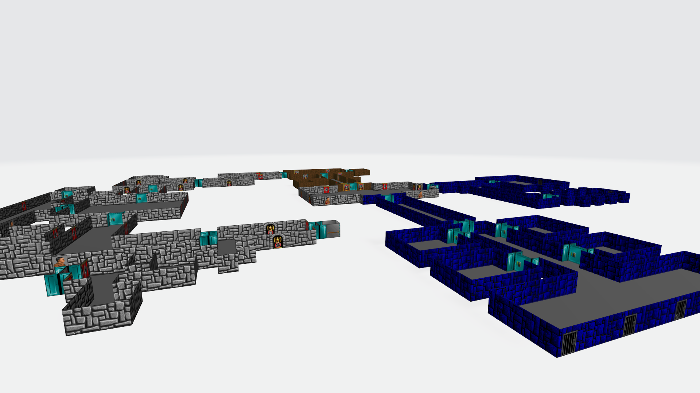

# Wolf3D Map to OBJ File

**This project is a work-in-progress.**

A script to export Wolfenstein 3D maps to OBJ object files.

## Getting Started

### Requirements

Python 3.6 or later, plus all [requirements.txt](requirements.txt) dependencies.

To install dependencies, run:

    pip install -r requirements.txt

## License

This project is licensed under the MIT License - see the [LICENSE](LICENSE) file for details.
